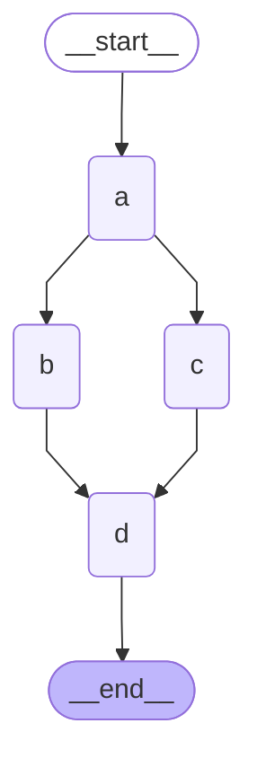

# graph-async

This project covers the asynchronous execution of nodes in a graph.



### Utilities

Poetry command to install project dependencies:
```sh
poetry add python-dotenv langgraph grandalf
```

Environment variables:
```
LANGCHAIN_API_KEY=<LangSmith API key>
LANGCHAIN_TRACING=true
LANGCHAIN_PROJECT=AsyncProject
```